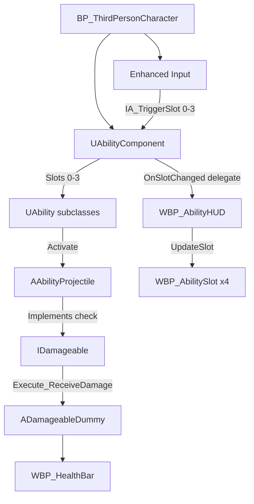

# Technical Notes — Unreal Ability System Prototype (C++)

**Purpose:** Architecture decisions and reasoning behind key implementation choices.
**Controls and links:** See `README.md`.

---

## 0) System map



---

## 1) Ability system architecture

Abilities are `UObject` subclasses — not Actors, not Components. The choice matters: Actors carry world transform, tick, replication scaffolding — none of which an ability needs. Each instance holds its own cooldown state (`NextReadyTime`), so slots are fully independent with no external state management.

`UAbilityComponent` owns the slots and exposes the public API. The slot storage:

```cpp
UPROPERTY()
TArray<TObjectPtr<UAbility>> Slots;
```

`UPROPERTY()` with no specifiers is enough for GC registration. Without it the GC doesn't see these references and can collect ability instances mid-frame — a non-deterministic crash that's hard to reproduce. `TObjectPtr` is the UE5 convention over raw pointers.

Abilities are instantiated with `NewObject<UAbility>(this, AbilityClass)` — `this` being the component sets the Outer, tying the ability's lifetime to the component.

`Activate` returns `bool` for one reason: cooldown only starts on successful activation.

```cpp
if (Ability->Activate(GetOwner()))
{
    Ability->StartCooldown();
}
```

**`[SCREENSHOT: Components panel showing UAbilityComponent on BP_ThirdPersonCharacter]`**

---

## 2) Input

Per-slot Input Actions (`IA_TriggerSlot0`–`IA_TriggerSlot3`). Adding a slot means one new asset and one new mapping — no encoding or decoding logic.

The `Pressed` trigger is defined in each Input Action asset rather than handled via pin selection in the graph — behavior defined at the asset level is more explicit.

**`[SCREENSHOT: IMC_Gameplay showing the 4 Input Actions mapped to keys 1-4]`**

---

## 3) Projectile

`AAbilityProjectile` is an Actor — needs world existence, position, movement. `UProjectileMovementComponent` handles forward movement.

Spawn location uses the character's forward vector. In third person the camera sits behind and above — spawning from camera position sent the projectile through the character mesh on every shot.

Damage lives on the ability. `Projectile->Damage = Damage` is set after spawn so different abilities can fire the same projectile class at different damage values.

The `bHasHit` guard exists because `Destroy()` isn't instant — without it overlap fires multiple times from a single hit.

---

## 4) Collision

Two custom entries in Project Settings:

**`Projectile` preset** — overlaps `Damageable`, `WorldStatic`, `Pawn`. Object type is `WorldDynamic`, so projectiles ignore each other. Defined once, referenced by name in code.

**`Damageable` Object Channel** — `WorldDynamic` would catch any moving actor. A custom channel keeps the intent explicit and the projectile profile tight.

**`[SCREENSHOT: Project Settings showing the Projectile collision preset and Damageable object channel]`**

---

## 5) Damage interface

`IDamageable` keeps the projectile decoupled from any specific enemy class.

```cpp
if (OtherActor->Implements<UDamageable>())
{
    IDamageable::Execute_ReceiveDamage(OtherActor, Damage, GetInstigator());
}
```

`InstigatorActor` is in the signature even though this prototype doesn't use it for gameplay logic. Kill credit, aggro, and damage resistance all need it — leaving it out now means a breaking interface change later.

---

## 6) HUD

`UAbilityComponent` broadcasts `FOnSlotChanged` on equip and trigger. The HUD binds to it — the component has no reference back to the HUD.

```cpp
DECLARE_DYNAMIC_MULTICAST_DELEGATE_OneParam(FOnSlotChanged, int32, SlotIndex);

UPROPERTY(BlueprintAssignable)
FOnSlotChanged OnSlotChanged;
```

The delegate handles discrete events. Cooldown countdown is different — time passes continuously with nothing to react to. A 0.1s repeating timer handles the display. The two mechanisms serve different purposes and work together.

`WBP_AbilityHUD` reads `GetSlotCount()` at construct time and creates exactly that many slot widgets — no hard-coded count. Slot widgets are stored in a `SlotWidgets` array in creation order; `OnSlotChanged` retrieves the right widget by index.

Icon dimming passes `bIsOnCooldown` into `UpdateSlot` rather than parsing the cooldown text string.

**`[SCREENSHOT: In-game HUD showing slot 0 on cooldown (dimmed, countdown) and slot 1 ready]`**

---

## 7) Health bars

`UWidgetComponent` (Space = World) renders `WBP_HealthBar` in 3D above each dummy. `Event Tick` rotates it toward the camera.

Hit flash uses a Dynamic Material Instance created on `BeginPlay`. The original `Color Emis` value is stored so it can be restored after the flash.

`BP_DamageableDummy_Base` holds all shared logic; child Blueprints only override mesh and material.

**`[SCREENSHOT: In-game health bar above a golem, partially depleted]`**

---

## 8) How to add a new ability

**Projectile-based:**
1. Create a C++ subclass of `UAbility`
2. Override `Activate_Implementation` — spawn `AAbilityProjectile`, set `Projectile->Damage`, return `true` on success
3. Expose tunables as `EditDefaultsOnly`
4. Create a Blueprint subclass — set cooldown, damage, assign `ProjectileClass` and VFX
5. `EquipAbility(SlotIndex, YourAbilityClass)` in the character BP

**Non-projectile (heal, buff, AOE):** same steps, `Activate_Implementation` does whatever the ability does. No changes to `UAbilityComponent`, the HUD, or input.

**New projectile behavior:** subclass `AAbilityProjectile` in C++, override `BeginPlay` or `OnSphereOverlap`, create a Blueprint subclass for assets.

---

## 9) Tradeoffs and limitations

- No object pooling — projectiles are spawned and destroyed per shot
- No multiplayer — no replication setup on `UAbilityComponent` or `UAbility`
- Billboard uses Tick — acceptable at this scale, not at larger enemy counts
